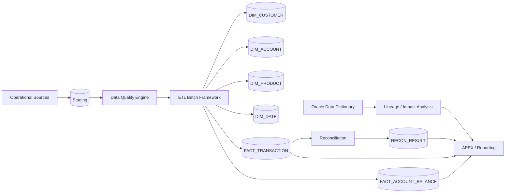
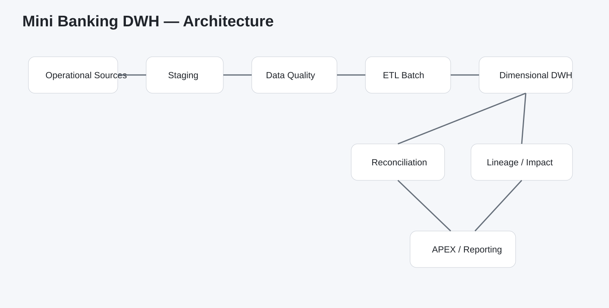
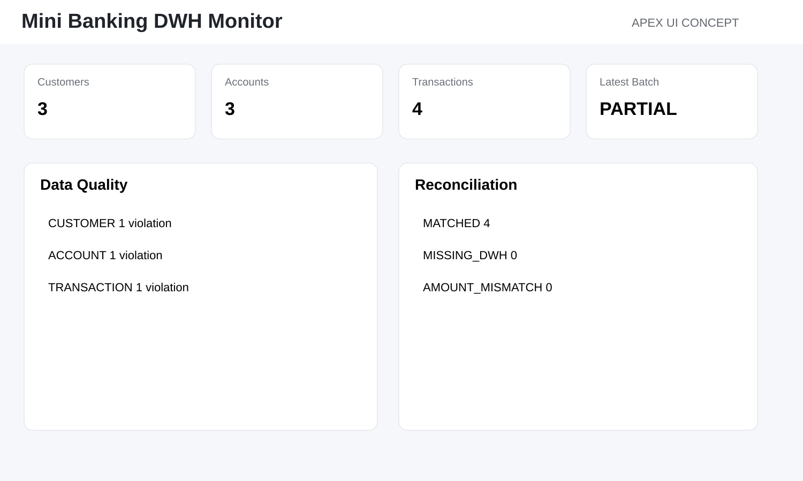
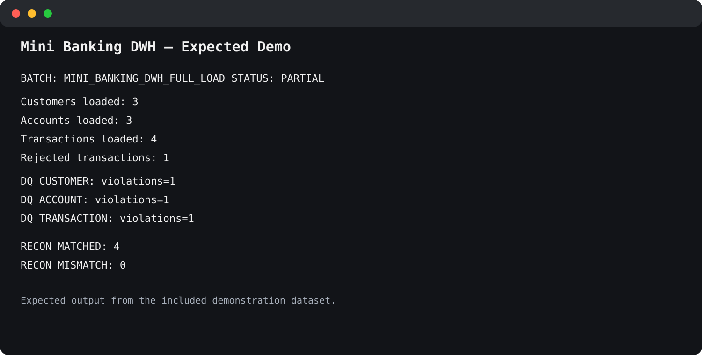

# Mini Banking Data Warehouse

<p align="center">
  
  
  
  
  
</p>

> **A compact Oracle banking data warehouse integrating ETL orchestration, data quality, SCD Type 2, reconciliation, lineage and an APEX-ready reporting layer.**

## Architecture



<p align="center">
  
</p>

## What the project demonstrates

This repository combines the patterns from four smaller Oracle portfolio projects into one coherent banking-style DWH:

- batch/job execution tracking;
- rejected rows and technical error logging;
- metadata-driven data quality rules;
- dimensional modeling;
- Slowly Changing Dimension Type 2;
- transaction and balance facts;
- reconciliation between staging and warehouse;
- Oracle dependency traversal;
- APEX dashboard design.

## Star schema

### Dimensions
- `DIM_CUSTOMER` — SCD Type 2
- `DIM_ACCOUNT`
- `DIM_PRODUCT`
- `DIM_DATE`

### Facts
- `FACT_TRANSACTION`
- `FACT_ACCOUNT_BALANCE`

## Repository structure

```text
mini-banking-dwh/
├── README.md
├── LICENSE
├── install.sql
├── uninstall.sql
├── sql/
├── plsql/
├── tests/
├── apex/
└── docs/
```

## Installation

```sql
@install.sql
```

The installer creates the schema objects, demo source data, rules, packages, reporting views and lineage helpers.

Designed for Oracle Database 19c+ and suitable for 23ai / 26ai.

## Quick start

```sql
@tests/01_run_full_load.sql
```

or:

```sql
begin
    pkg_dwh_load.run_full_load;
end;
/
```

Then inspect:

```sql
select * from v_batch_latest;
select * from v_dq_latest order by entity_name;
select * from v_recon_latest_summary order by result_status;
select * from v_monthly_transaction_summary;
```

Additional test scenarios:

```sql
@tests/06_scd2_change.sql
@tests/07_reconciliation_mismatch.sql
```

## ETL Batch Framework

Control tables:

```text
BATCH_RUN
JOB_RUN
ERROR_LOG
REJECTED_ROW
```

The framework records execution status, timestamps and row counts while keeping transformation logic in `PKG_DWH_LOAD`.

Supported statuses:

```text
RUNNING
SUCCESS
PARTIAL
FAILED
```

## Data Quality

Metadata tables:

```text
DQ_RULE
DQ_EXECUTION
DQ_VIOLATION
```

Demo checks include:

- mandatory customer name;
- valid customer status;
- account/customer relationship;
- positive transaction amount;
- allowed currencies;
- non-future transaction date.

Violations are stored at row level rather than only as aggregate counts.

## SCD Type 2 Customer Dimension

Tracked attributes:

```text
CUSTOMER_NAME
CUSTOMER_SEGMENT
STATUS_CODE
COUNTRY_CODE
```

Historical rows use:

```text
VALID_FROM
VALID_TO
IS_CURRENT
```

Example:

```text
CUSTOMER_ID  SEGMENT   VALID_FROM  VALID_TO    IS_CURRENT
-----------  --------  ----------  ----------  ----------
1001         RETAIL    2026-01-01  2026-09-20  N
1001         PREMIUM   2026-09-21  NULL        Y
```

## Transaction Fact

`FACT_TRANSACTION` contains:

- source transaction reference;
- customer/account/product/date surrogate keys;
- transaction type;
- amount;
- signed amount;
- fee;
- currency.

A debit is stored with negative `SIGNED_AMOUNT`; a credit is positive.

## Daily Balance Fact

`FACT_ACCOUNT_BALANCE` stores one account snapshot per day.

This supports:

- balance trends;
- balances by product;
- portfolio reporting;
- end-of-day exposure analysis.

## Reconciliation

The project reconciles valid staging transactions against the DWH fact.

Statuses:

```text
MATCHED
MISSING_DWH
AMOUNT_MISMATCH
DUPLICATE_SOURCE
DUPLICATE_DWH
```

Reconciliation is independent from technical ETL success: a load can complete technically but still fail a business completeness check.

## Lineage & Impact Analysis

Example:

```sql
select *
from table(
    pkg_lineage.downstream(
        p_object_name => 'STG_TRANSACTION',
        p_max_depth   => 10
    )
);
```

The project intentionally calls this **object-level dependency analysis**. It does not claim that Oracle dependency metadata alone provides complete semantic column-level lineage.

## APEX Dashboard

The repository includes a page-by-page build guide for:

1. Executive Dashboard
2. Batch Monitoring
3. Data Quality
4. Reconciliation
5. Customer 360
6. Account Balances
7. Transaction Explorer
8. Lineage / Impact Analysis

See `apex/README.md`.

### UI concept

The following is a **design concept**, not a screenshot of a deployed APEX application.

<p align="center">
  
</p>

## Demo output

<p align="center">
  
</p>

## Design & Engineering Decisions

### Separate control metadata from transformation logic
Batch and job execution metadata is handled by `PKG_BATCH`; DWH transformations remain in `PKG_DWH_LOAD`.

### Validate before warehouse promotion
Data quality rules run on staging before the business load. Invalid source rows are not silently accepted.

### Use surrogate keys in facts
Facts reference warehouse surrogate keys rather than source business keys, enabling historized dimensions and source-system decoupling.

### Historize only where business value justifies it
`DIM_CUSTOMER` uses SCD Type 2; simpler dimensions use Type 1-style upsert behavior. This keeps the model pragmatic.

### Make reruns deterministic
Dimension/fact loads use `MERGE`, stable business keys and existence checks to reduce duplicate risk.

### Keep reconciliation separate from ETL
Technical execution status and business completeness are different controls, so reconciliation has its own run and result tables.

### Preserve detailed evidence
DQ violations, rejected rows, technical errors and reconciliation exceptions are stored individually.

### Treat lineage as a graph
Dependency traversal uses cycle protection and supports both upstream and downstream analysis.

### Keep APEX outside the core DWH
The warehouse is fully functional without APEX. The UI consumes stable views and package APIs.

## Key Takeaways

- A DWH needs operational control and observability, not only a star schema.
- ETL success does not prove business reconciliation.
- Data quality should retain row-level evidence.
- SCD Type 2 preserves business history.
- Surrogate keys are central to dimensional modeling.
- Lineage should distinguish structural dependency from semantic lineage.
- APEX is effective as a monitoring and analytical layer over Oracle services.

## Skills demonstrated

Oracle SQL · PL/SQL · ETL · Data Warehousing · Star Schema · SCD Type 2 · Data Quality · Reconciliation · Batch Processing · MERGE · Error Handling · Data Lineage · Impact Analysis · Oracle APEX · Banking Data Concepts

## Possible extensions

- CDC / incremental loading;
- partitioned transaction facts;
- materialized views;
- `DBMS_SCHEDULER`;
- ODI orchestration;
- late-arriving dimensions;
- FX conversion;
- account-level reconciliation;
- data retention;
- ORDS API;
- APEX RBAC;
- million-row performance tests.

## LinkedIn

A ready-to-use LinkedIn entry is in:

```text
docs/linkedin-project.md
```

## License

MIT. See `LICENSE`.
